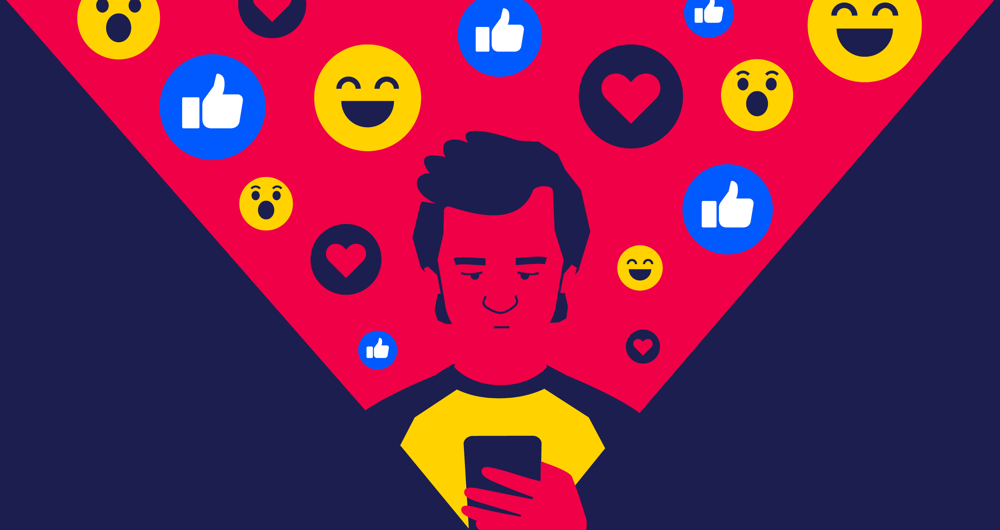

*Illustration by Grabbins

Ebbene si, non ne ho.
O meglio, ne ho pochi, e quelli che ho non li uso un granch&eacute;.

In molti, moltissimi hanno detto la loro sul potere *distrattivo* dei social nework, ma come cavolo si fa oggi nel 2022 a non rimanere intrappolati in quella melma succhia sangue senza non rimanere fuori dal mondo?

Non lo so.
&Eacute; questa la verit&agrave;, non lo so.

Ma questo &egrave; quello che provo a fare io armai da qualche annetto.
I primi social che ho usato sono stati un abominio (in tutti i sensi, date un occhio a [questo articolo](https://www.lemacchinevolanti.it/approfondimenti/archeologia-dei-social-network) che descrive i primi social diffusi in Italia. Ah, nenache a dirlo, li si usava solo dal PC), ma dopo essere passato a Facebook in pianta stabile per qualche anno, ho iniziato ad interrogarmi so cosa potevano darmi, in che modo potessero i social arricchirmi? Perch&egrave; la maggior parte delle volte mi ritrovavo ad aver scrollato post dopo post, dei quali non mi interessava poi molto (*es. una paresona che avevo incontrato per caso ad una festa 5 anni prima che informava la sua rete che durante la catastrofe di turno, appena avvenuta dall'atra parte del mondo si trovava sano e salvo a casa sua a Busto Arsizio. Si, proprio lui che non si era mai mosso dalla lombardia informava tutti che, nel momento del disastro, si trovava a casa. Ma dai? Non l'avrei mai detto!*) per anche delle ore, abbastanza annoiato e con tutte le cose da fare rimaste indietro!

In breve, avevo perso un sacco di tempo.

Nel frattempo e' arrivato Instagram, ho pensato "*Bello, un luogo dove mettere tutte le mie foto, e condividerle con i miei amici! Qui non si pu&ograve; scrivere, nessuno potr&agrave; postare fake news e giudizi approssimativi e qualunquisti! Solo foto, e magari di bei paesaggi!*"
**SBAGLIATO**

Mi sono ritrovato nella stessa situazione, ma su un'app diversa.
Ho provato diverse volte semplicemente a disabilitare le app incrimite o a disistallarle, ma ci ricascavo sempre.

Nel frattempo, un docufilm su Neflix veniva rilsciato *The social dilemma*. Questo mostrava come ogni social network fosse studiato appositamente per far passare alle persone pi&ugrave; tempo possibile sulla loro app.
Incredibile &egrave; che nemmeno gli stessi CEO o addetti ai lavori in generale ne fossero immuni. 

Non si tratta di codice, ma di psicologia.

L'intera interfaccia e interazione che l'utente ha con l'app (*i.e.* UX), &egrave; studiata in modo che possa rilasciare quanta pi&ugrave; dopamina possibile, rendendo di fatto l'utente - secondo me - di fatto dipendente. E il tutto per poterlo profilare al meglio e proporgli pubblicit&agrave; sempre pi&ugrave; azzeccate al suo stile di vita, i suoi gusti fino a riuscire ad antacipare e guidare i suoi desideri.

Detto in breve, ho sfruttato il [diritto all'oblio](https://www.garanteprivacy.it/regolamentoue/oblio) e ho fatto cancellare i miei dati da Facebook e Instagram. Questo ovviamente non mi esclude dalla profilazione: utilizzo Google, Whatsapp, Youtube, Reddit (anche se spesso metto un limite di tempo all'utilizzo dell'app), e molti altri servizi di uso comune.

Ma quello che mi chiedo sempre quando mi accorgo di passare troppo tempo a fare qualcosa - in questo caso sui social

> Mi serve? 
>
> Cosa ne sto ottenendo?

Visto che questo post si sta dilungando un p&ograve; troppo e rischia di uscire fuori tema, credo sia meglio chiudere qui.

Per ora &egrave; tutto, a presto.